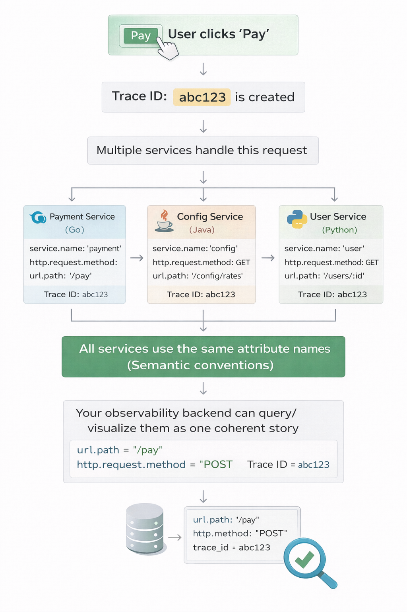

# Day 5 – Semantic Conventions: The Shared Language of Observability

Yesterday we learned that spans have attributes like `http.request.method = "POST"` and `db.statement = "SELECT * FROM rates"`. Today's question is: **Why those specific names? Why not `request_method` or `sql_query`?**

The answer reveals something fundamental about how observability actually works at scale.

## The problem: chaos without standards

Imagine three teams building microservices:

**Payment Service (Go):**
```
request_method: "POST"
request_path: "/pay"
```

**Config Service (Java):**
```
http.request.method: "GET"
url.full: "https://api.example.com/config/rates"
```

**User Service (Python):**
```
method: "GET"
route: "/users/:id"
```

Now try to answer: **"Show me all 500 errors across all services."**

You can't. Each service uses different attribute names. Your query tool doesn't know that `request_method`, `http.request.method`, and `method` all mean the same thing.

**This is the fundamental challenge of distributed systems observability:** You're not observing one application. You're observing dozens of services, written in different languages, by different teams, using different frameworks. Without a common language, your telemetry data is useless.

## The Solution: Semantic conventions

**Semantic conventions** are OpenTelemetry's solution: a standard dictionary that says:

> "When you record an HTTP request, call the method `http.request.method`. When you record a database query, call it `db.statement`. Everyone uses these exact names."

It's not just names—it's also the format of values:
- HTTP method is `GET`, not `get` or `Get`
- Database system is `postgresql`, not `postgres` or `Postgres` or `psql`

### How semantic conventions connect to everything we've learned

**Day 3:** Traces record a request's journey through multiple services  
**Day 4:** Traces are made of spans with attributes  
**Day 5:** Attributes need standard names, or traces from different services can't be queried, compared or visualized together  

Here's the flow:



**Without semantic conventions, that last step breaks.** You'd have traces, but they'd be incompatible islands of data.

>[!IMPORTANT]
>**Semantic conventions vs attributes**
>
>You already know what attributes are. Semantic conventions do not replace attributes. They just standardize which attributes to use for common concepts.
>
>Think of it like this:
>
>-Attributes are facts
>
>-Semantic conventions are grammar rules for those facts

## The two types of attributes

### 1. Infrastructure attributes (standardized)

These cover operations every system does: HTTP, databases, queues, RPC.

Common namespaces:
- `http.*` — HTTP requests/responses
- `db.*` — Database operations
- `messaging.*` — Message queues (Kafka, RabbitMQ, etc.)
- `rpc.*` — Remote procedure calls (gRPC, etc.)

**Example:**
```
http.request.method = "GET"
http.route = "/users/:id"
db.system = "postgresql"
```

### 2. Business attributes (custom, but follow the pattern)

These describe **your specific domain** like Payment amounts, Order details, User tiers etc.

**Example:** Your payment service records business context:
```
payment.amount = 49.99
payment.currency = "USD"
payment.method = "credit_card"
```

There's no OpenTelemetry standard for `payment.*` because it's your business logic. But you still follow the pattern:
- Use a namespace (`payment.*`)
- Use lowercase with underscores
- Be consistent across your services

This means your queries work consistently and new team members can guess attribute names.

## From code to query: how it works end-to-end

Let's walk through how semantic conventions connect everything:

### Step 1: You write normal code and it runs (local)

```javascript
// Your Express.js endpoint
app.post('/pay', async (req, res) => {
  const result = await processPayment(req.body);
  res.json(result);
});
```

### Step 2: Instrumentation applies conventions automatically

OpenTelemetry's Express library creates a span:
```
Span:
  name: "POST /pay"
  attributes:
    http.request.method = "POST"     ← Automatic
    http.route = "/pay"              ← Automatic
    http.response.status_code = 200  ← Automatic
```

You wrote zero observability code. The library applied semantic conventions.

>[!NOTE]
> **What's actually happening here (we'll learn more tomorrow):**
> 
> The Express library is calling the **OpenTelemetry Tracing API** behind the scenes:
> ```javascript
> span.setAttribute('http.request.method', 'POST');
> span.setAttribute('http.route', '/pay');
> span.setAttribute('http.response.status_code', 200);
> ```
> 
> Tomorrow (Day 6) you'll learn WHO creates spans and WHEN you need to create them yourself using this same API.

### Step 3: Span goes to your observability backend (global)

This span, along with spans from all your other services, gets stored in [Dash0](https://www.dash0.com/) for instance.

### Step 4: You query using standard names
```
# Find slow HTTP requests across ALL services
http.response.status_code = 200 AND duration > 1000ms
```

## The hierarchy: how conventions fit into the bigger architecture

Let's zoom out and see where semantic conventions fit:

```
┌─────────────────────────────────────────────┐
│ Your Application Code                       │  ← You write this
└─────────────────────────────────────────────┘
                  ↓
┌─────────────────────────────────────────────┐
│ Instrumentation Libraries                   │  ← Apply semantic conventions
│ (Express, PostgreSQL client, etc.)          │     automatically
└─────────────────────────────────────────────┘
                  ↓
┌─────────────────────────────────────────────┐
│ OpenTelemetry SDK                           │  ← Sends spans to backend
└─────────────────────────────────────────────┘
                  ↓
┌─────────────────────────────────────────────┐
│ Observability Backend                       │  ← Stores spans, lets you query
│ (Dash0, Jaeger, etc.)                       │     using semantic convention names
└─────────────────────────────────────────────┘
                  ↓
┌─────────────────────────────────────────────┐
│ Your Queries & Dashboards                   │  ← You query using convention names
│ "http.status_code >= 500"                   │
└─────────────────────────────────────────────┘
```

**Semantic conventions are the contract** that makes this whole chain work. Without them:
- Instrumentation libraries would invent their own names
- Different backends would expect different formats
- Your queries wouldn't work across services

## Resources follow conventions too

Remember resources from Day 4? They describe *who* created the span. Semantic conventions apply to resources too:

```
service.name = "payment-service"
service.version = "2.3.1"
deployment.environment = "production"
k8s.cluster.name = "prod-us-east-1"
k8s.pod.name = "payment-7d8f9-abc12"
```

This lets you filter traces:

```
# Show me traces from production payment service
service.name = "payment-service" AND deployment.environment = "production"

# Show me traces from the us-east-1 cluster
k8s.cluster.name = "prod-us-east-1"
```

**The pattern is the same:** Standard names → Universal queries.

## Real workflow: one example from alert to resolution

Let's see how semantic conventions enable real workflows:

**Alert:** "p95 latency is high"

**Step 1: Metrics tell you when**
```
# Query your metrics
payment_service_latency_p95 > 1000ms at 14:30
```

**Step 2: Traces tell you where (using semantic conventions)**
```
# Query for slow traces
service.name = "payment-service" AND duration > 1000ms AND timestamp > 14:30
```

**Step 3: Open a trace, see spans with standard attributes**
```
Span: GET /config/rates (2000ms)
  Attributes:
    http.request.method = "GET"
    http.route = "/config/rates"
    http.response.status_code = 200
```

**Step 4: Find the root cause**
Child span shows:
```
Span: SELECT rates (1950ms)
  Attributes:
    db.system = "postgresql"
    db.statement = "SELECT * FROM rates WHERE currency = $1"
    db.rows_returned = 150000  ← Way too many rows!
```

**Step 5: Fix and verify**
You add an index. Then query:
```
# Verify the fix
db.statement CONTAINS "SELECT * FROM rates" AND duration < 100ms
```

Every step worked because everyone used the same attribute names.

## Where to look them up
Official spec: https://opentelemetry.io/docs/specs/semconv/

You don't need to memorize them. Just know where to look when creating custom spans.

## What I'm taking into Day 6

Today's core message: **Semantic conventions are the reason observability works across distributed systems. They're the shared language that lets spans from different services, teams, and languages be queried together.**

The connection to everything else:
- **Day 3:** Traces record a request's journey
- **Day 4:** Traces are made of spans with attributes
- **Day 5:** Attributes need standard names (semantic conventions) or the system falls apart

Tomorrow we'll talk about **instrumentation**: how spans actually get created in your code. We'll learn the difference between automatic instrumentation (libraries do it for you) and manual instrumentation (you write code), and when to use each.

See you on Day 6!
