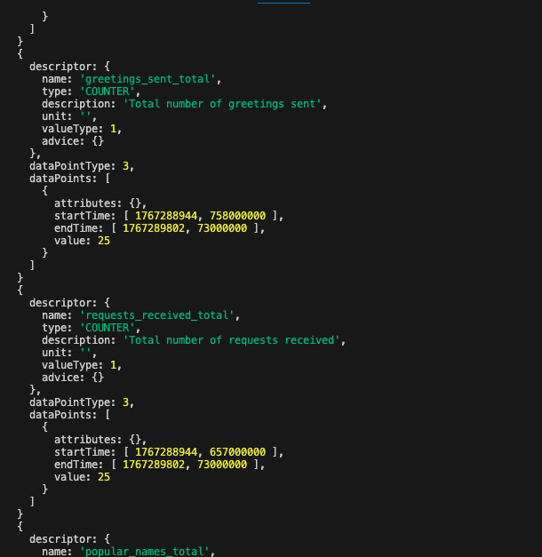

# Day 10 – Metrics API: Counting What Matters

Yesterday we learned the Tracing API and created spans to follow individual requests through our system. Today we add **basic metrics** so we can answer simple questions like "How many greetings have we sent?" and "What's our most popular name?"

> **Working example:** The complete code for this tutorial is available in [`examples/day10-metrics-api/`](../examples/day10-metrics-api/)
>
> **Note:** This builds on Day 9. If you haven't done Day 9 yet, start there: [`examples/day9-tracing-api/`](../examples/day9-tracing-api/)

---

## What we already know from Week 1

We've already been exposed to metrics concepts:

- **[Day 3](https://github.com/juliafmorgado/30DaysOtel/blob/main/week1/day3.md):** Metrics show patterns across many requests, traces show individual requests
- **[Day 6](https://github.com/juliafmorgado/30DaysOtel/blob/main/week1/day6.md):** Auto-instrumentation creates metrics automatically

Today's focus: creating our **own simple metrics** using the Metrics API.

---

## Metrics vs Traces: The simple difference

| Traces | Metrics |
|--------|---------|
| Individual requests | Many requests combined |
| "Alice's greeting took 105ms" | "We sent 50 greetings today" |
| "Why did this specific request fail?" | "How many requests are failing?" |
| Debugging individual problems | Seeing overall patterns |

**Think of it like this:**
- **Traces** = Individual stories ("Alice's greeting was processed successfully")
- **Metrics** = Statistics ("We've sent 1,000 greetings this hour")

---

## The one metric type we'll learn today: Counter

For beginners, we only need to understand **counters** → numbers that only go up.

### Counter (counts things that happen)

Counts events that accumulate over time: greetings sent, requests received, errors that occurred.

**Examples:**
- `greetings_sent_total` → How many greetings we've sent (starts at 0, goes up)
- `requests_received_total` → How many HTTP requests we got (starts at 0, goes up)
- `popular_names_total` → Count of each name requested (Alice: 5, Bob: 3, etc.)

**Key rule:** Counters only increase. They reset to 0 when your app restarts.

---

## What we're building today

We'll add **simple counting metrics** to the greeting API from Day 9:

**Metrics we'll track:**
1. **Counter:** Total greetings sent
2. **Counter:** Total requests received  
3. **Counter:** Popular names (with labels)

That's it! Simple counting to see patterns.

---

## Step 1: Set up the project

If you finished Day 9, copy that project:

```bash
cp -r day9-tracing-api day10-metrics-api
cd day10-metrics-api
```

If starting fresh:

```bash
mkdir day10-metrics-api
cd day10-metrics-api
npm init -y
```

**Install dependencies:**

```bash
npm install express \
  @opentelemetry/api \
  @opentelemetry/sdk-node \
  @opentelemetry/sdk-metrics \
  @opentelemetry/resources \
  @opentelemetry/semantic-conventions \
  @opentelemetry/auto-instrumentations-node \
  @opentelemetry/exporter-trace-otlp-http \
  @opentelemetry/exporter-metrics-otlp-http
```

---

## Step 2: Update instrumentation to include metrics

Update `instrumentation.js` to export metrics alongside traces:

```javascript
// instrumentation.js
const { NodeSDK } = require("@opentelemetry/sdk-node");
const { getNodeAutoInstrumentations } = require("@opentelemetry/auto-instrumentations-node");
const { OTLPTraceExporter } = require("@opentelemetry/exporter-trace-otlp-http");
const { ConsoleMetricExporter, PeriodicExportingMetricReader } = require("@opentelemetry/sdk-metrics");
const { resourceFromAttributes } = require("@opentelemetry/resources");
const { ATTR_SERVICE_NAME, ATTR_SERVICE_VERSION } = require("@opentelemetry/semantic-conventions");

const sdk = new NodeSDK({
  resource: resourceFromAttributes({
    [ATTR_SERVICE_NAME]: "greeting-service",
    [ATTR_SERVICE_VERSION]: "1.0.0",
  }),
  
  // Traces (from Day 9)
  traceExporter: new OTLPTraceExporter({
    url: "http://localhost:4318/v1/traces",
  }),
  
  // Metrics (NEW for Day 10)
  metricReader: new PeriodicExportingMetricReader({
    exporter: new ConsoleMetricExporter(),
    exportIntervalMillis: 10000, // Export every 10 seconds for faster feedback
  }),
  
  instrumentations: [getNodeAutoInstrumentations()],
});

sdk.start();
console.log("OpenTelemetry initialized with traces and metrics");
```

**What's new:**
- **ConsoleMetricExporter** - Shows metrics in your terminal (for learning)
- **PeriodicExportingMetricReader** - Exports metrics every 10 seconds

> **Note:** We're using `ConsoleMetricExporter` for learning purposes. In production, you'd use `OTLPMetricExporter` to send metrics to observability backends like Dash0, or Prometheus. We'll explore metrics backends on Day 15.

---

## Step 3: Add metrics to the greeting app

Update `app.js` to include metrics alongside the tracing from Day 9:

```javascript
// app.js
const express = require('express');
const { trace, metrics } = require('@opentelemetry/api');

const app = express();

// Get a tracer (from Day 9)
const tracer = trace.getTracer('greeting-service', '1.0.0');

// Get a meter (NEW for Day 10)
const meter = metrics.getMeter('greeting-service', '1.0.0');

// =========================
// METRICS (create once, use everywhere)
// =========================

// Create counters once at startup
const greetingsTotal = meter.createCounter("greetings_sent_total", {
  description: "Total number of greetings sent",
});

const requestsTotal = meter.createCounter("requests_received_total", {
  description: "Total number of requests received",
});

const popularNames = meter.createCounter("popular_names_total", {
  description: "Count of greetings by name",
});

// =========================
// GREETING ENDPOINT (building on Day 9)
// =========================

app.get('/hello/:name', (req, res) => {
  // Count every request received
  requestsTotal.add(1);
  
  // Create a span for our greeting operation (from Day 9)
  tracer.startActiveSpan('create_greeting', (span) => {
    const name = req.params.name;
    
    // Add attributes to describe what we're doing (from Day 9)
    span.setAttribute('user.name', name);
    span.setAttribute('greeting.type', 'personal');
    
    // Add an event to mark when we start processing (from Day 9)
    span.addEvent('processing_started');
    
    // Simulate some processing time
    setTimeout(() => {
      // Create a nested span for message formatting (from Day 9)
      tracer.startActiveSpan('format_message', (formatSpan) => {
        const message = `Hello, ${name}! Welcome to OpenTelemetry tracing and metrics.`;
        
        formatSpan.setAttribute('message.length', message.length);
        formatSpan.addEvent('message_formatted');
        formatSpan.end();
        
        // Count every greeting sent (NEW for Day 10)
        greetingsTotal.add(1);
        
        // Count this specific name (NEW for Day 10) -> These are counters with labels (dimensions)
        popularNames.add(1, { name: name });
        
        // Add final attributes and events to parent span (from Day 9)
        span.setAttribute('response.message', message);
        span.addEvent('processing_completed');
        span.end();
        
        res.json({ 
          message,
          timestamp: new Date().toISOString()
        });
      });
    }, 100);
  });
});

// Health check endpoint (no manual instrumentation)
app.get('/health', (req, res) => {
  res.json({ status: 'ok' });
});

const PORT = 3000;
app.listen(PORT, () => {
  console.log(`Greeting service listening on port ${PORT}`);
  console.log('Try: curl http://localhost:3000/hello/Alice');
  console.log('Metrics will be exported every 10 seconds');
});
```

**What's new for Day 10:**
- **Meter:** Your metrics factory - `metrics.getMeter()`
- **Counters:** Count events that happen - `meter.createCounter()`
- **Adding values:** Increment counters - `counter.add(1)`
- **Labels:** Add dimensions to metrics - `{ name: "Alice" }`
- **Export:** Metrics are sent automatically every 10 seconds

---


---

## Step 4: Run and test

**Start Jaeger (for traces):**
```bash
docker run -d --name jaeger \
  -p 16686:16686 \
  -p 4318:4318 \
  jaegertracing/all-in-one:latest
```

**Run the application:**
```bash
node -r ./instrumentation.js app.js
```

**Send test requests:**
```bash
# Send multiple greetings to generate metrics
curl http://localhost:3000/hello/Alice
curl http://localhost:3000/hello/Bob
curl http://localhost:3000/hello/Alice
curl http://localhost:3000/hello/Charlie
curl http://localhost:3000/hello/Alice

# Generate more data
for i in {1..10}; do
  curl http://localhost:3000/hello/User$i
done
```

**You should our custom metrics in the terminal:**



**What this tells us:**
- We've sent 15 greetings total - `greetings_sent_total`
- Alice was the most popular name (3 requests) - `popular_names_total`
- Bob was requested once

**Note:** You'll see many more metrics in your terminal (Node.js runtime metrics, HTTP metrics, etc.). These come from auto-instrumentation. Focus on finding the metrics with names you created: `greetings_sent_total`, `requests_received_total`, and `popular_names_total`.

**You can also view the trace in Jaeger on http://localhost:16686**

---

## Exercises to try

### Exercise 1: Add a message length counter

Track the total characters in all messages sent:

<details>
<summary>Click to see the solution</summary>

```javascript
// Add this with other counters
const messageChars = meter.createCounter("message_characters_total", {
  description: "Total characters in all messages sent",
});

// In the format_message span
const message = `Hello, ${name}! Welcome to OpenTelemetry tracing and metrics.`;

// Add this line
messageChars.add(message.length);
```

</details>

### Exercise 2: Track processing time ranges

Count how many requests take different time ranges:

<details>
<summary>Click to see the solution</summary>

```javascript
// Add this counter
const processingTime = meter.createCounter("processing_time_ranges_total", {
  description: "Count of requests by processing time range",
});

// In the setTimeout (after 100ms delay)
const timeRange = "100-200ms"; // Since we know it's ~100ms
processingTime.add(1, { range: timeRange });
```

</details>

---

## What I'm taking into Day 11

Today we learned the **Metrics API** basics:

**Key skills:**
- Getting a meter with `metrics.getMeter()`
- Creating counters to count events that happen with `meter.createCounter()`
- Incrementing counters to add values with `counter.add()`
- Using labels to add dimensions - `{ name: "Alice" }`
- Combining metrics with tracing from Day 9

**The basic pattern:**
```javascript
// Setup (once)
const meter = metrics.getMeter('service-name', '1.0.0');
const counter = meter.createCounter('events_total');

// Usage (everywhere)
counter.add(1);                    // Count an event
counter.add(1, { type: 'error' }); // Count with context
```

Tomorrow (Day 11) we'll learn the **Logs API** to complete the basic trio of traces, metrics, and logs.

See you on Day 11!