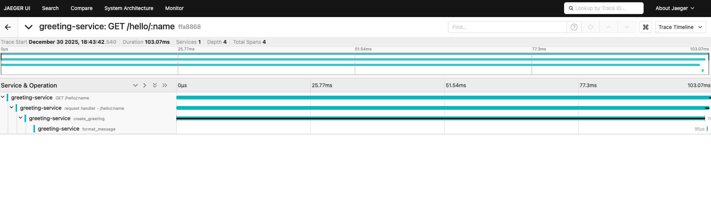

# Day 9 – Tracing API: Building Rich, Observable Request Stories

Yesterday we learned that the OpenTelemetry API is what we use in our code, while the SDK handles configuration. Today we get hands-on with the **Tracing API**, the part of OpenTelemetry that lets us create detailed traces of our application's behavior.

> **Working example:** The complete code for this tutorial is available in [`examples/day9-tracing-api/`](../examples/day9-tracing-api/)

---
## What we already know from Week 1

- **[Day 4](https://github.com/juliafmorgado/30DaysOtel/blob/main/week1/day4.md):** We learned spans have names, attributes, and parent-child relationships → Today we'll create those ourselves
- **[Day 5](https://github.com/juliafmorgado/30DaysOtel/blob/main/week1/day5.md):** We learned semantic conventions like `http.request.method` → Today we'll use them in `span.setAttribute()`
- **[Day 6](https://github.com/juliafmorgado/30DaysOtel/blob/main/week1/day6.md):** We learned auto-instrumentation calls the Tracing API → Today we'll call the same API manually

**The API methods aren't new, we've been learning about them all week.** Today we practice using them.

## What we're building today: A simple greeting service

We're going to build a basic Express API that creates personalized greetings. This simple example will let us focus on learning the Tracing API without getting distracted by complex business logic.

**Our greeting API will:**
1. **Accept a name** - Get the user's name from the URL
2. **Create a greeting** - Generate a personalized message
3. **Add some processing time** - Simulate real work with a small delay

**Why this example is perfect for learning:**
- **Simple and focused** - Easy to understand what each span represents
- **Shows parent-child relationships** - We'll create nested spans
- **Demonstrates key concepts** - Attributes, events, and span lifecycle
- **Quick to test** - Just curl a URL to see results

---
## Step 1: Set up the project

Create a new directory and initialize it:

```bash
mkdir otel-tracing-basics
cd otel-tracing-basics
npm init -y
```

**Install dependencies:**

```bash
npm install express @opentelemetry/api @opentelemetry/sdk-node @opentelemetry/resources @opentelemetry/semantic-conventions @opentelemetry/auto-instrumentations-node @opentelemetry/exporter-trace-otlp-http
```

**Our project structure will be:**
```
otel-tracing-api/
├── instrumentation.js    (SDK configuration)
├── app.js                (Express app with manual instrumentation)
└── package.json
```

---

## Step 2: Configure OpenTelemetry (instrumentation.js)

Before we write any application code, we need to set up OpenTelemetry. This configuration tells the SDK how to process and export our telemetry data.

Create `instrumentation.js`:

```javascript
// instrumentation.js
const { NodeSDK } = require("@opentelemetry/sdk-node");
const { getNodeAutoInstrumentations } = require("@opentelemetry/auto-instrumentations-node");
const { OTLPTraceExporter } = require("@opentelemetry/exporter-trace-otlp-http");
const { resourceFromAttributes } = require("@opentelemetry/resources");
const { ATTR_SERVICE_NAME, ATTR_SERVICE_VERSION } = require("@opentelemetry/semantic-conventions");

const sdk = new NodeSDK({
  resource: resourceFromAttributes({
    [ATTR_SERVICE_NAME]: "greeting-service",
    [ATTR_SERVICE_VERSION]: "1.0.0",
  }),
  traceExporter: new OTLPTraceExporter({
    url: "http://localhost:4318/v1/traces",
  }),
  instrumentations: [getNodeAutoInstrumentations()],
});

sdk.start();
console.log("OpenTelemetry initialized");
```

**Let's break down what each part does:**

**Resource configuration:**
```javascript
resource: resourceFromAttributes({
  [ATTR_SERVICE_NAME]: "greeting-service",
  [ATTR_SERVICE_VERSION]: "1.0.0",
})
```
This tells OpenTelemetry "who" is creating the telemetry data. Every span will automatically include these attributes, making it easy to filter traces by service and version in Jaeger.

> **Note:** We use `resourceFromAttributes()` instead of the deprecated `new Resource()` constructor. [OpenTelemetry 2.x](https://opentelemetry.io/blog/2025/otel-js-sdk-2-0/) moved away from exporting classes to improve API stability and enable better tree-shaking.

**Trace exporter:**
```javascript
traceExporter: new OTLPTraceExporter({
  url: "http://localhost:4318/v1/traces",
})
```
This tells OpenTelemetry "where" to send trace data. OTLP (OpenTelemetry Protocol) is the standard format, and Jaeger accepts OTLP on port 4318.

**Auto-instrumentation:**
```javascript
instrumentations: [getNodeAutoInstrumentations()]
```
This automatically creates spans for Express routes, HTTP requests, database calls, and other common operations. We'll add our own manual spans on top of these automatic ones.

**Why we configure this separately:** Remember from [Day 8](./day8.md) - this separation means we can change SDK implementations (standard → vendor distribution) or configuration (100% sampling → 10% sampling) without touching our application code.

---

## Step 3: Create the Express app (app.js)

Create `app.js`:

```javascript
// app.js
const express = require('express');
const { trace } = require('@opentelemetry/api');

const app = express();

// Get a tracer (our span factory)
const tracer = trace.getTracer('greeting-service', '1.0.0');

// Simple greeting endpoint with manual instrumentation
app.get('/hello/:name', (req, res) => {
  // Create a span for our greeting operation
  tracer.startActiveSpan('create_greeting', (span) => {
    const name = req.params.name;
    
    // Add attributes to describe what we're doing
    span.setAttribute('user.name', name);
    span.setAttribute('greeting.type', 'personal');
    
    // Add an event to mark when we start processing
    span.addEvent('processing_started');
    
    // Simulate some processing time
    setTimeout(() => {
      // Create a nested span for message formatting
      tracer.startActiveSpan('format_message', (formatSpan) => {
        const message = `Hello, ${name}! Welcome to OpenTelemetry tracing.`;
        
        formatSpan.setAttribute('message.length', message.length);
        formatSpan.addEvent('message_formatted');
        formatSpan.end();
        
        // Add final attributes and events to parent span
        span.setAttribute('response.message', message);
        span.addEvent('processing_completed');
        span.end();
        
        res.json({ 
          message,
          timestamp: new Date().toISOString()
        });
      });
    }, 100);
  });
});

// Health check endpoint (no manual instrumentation)
app.get('/health', (req, res) => {
  res.json({ status: 'ok' });
});

const PORT = 3000;
app.listen(PORT, () => {
  console.log(`Greeting service listening on port ${PORT}`);
  console.log('Try: curl http://localhost:3000/hello/Alice');
});
```

---

## Step 4: Start Jaeger (to view traces)

We need a backend to receive and visualize traces. Let's use Jaeger. For this we need Docker Desktop installed and running.

```bash
docker run -d --name jaeger \
  -p 16686:16686 \
  -p 4318:4318 \
  jaegertracing/all-in-one:latest
```

**Open Jaeger UI:** http://localhost:16686

---

## Step 5: Run the application

Start the app with OpenTelemetry enabled:

```bash
node --require ./instrumentation.js app.js
```

We should see:
```
OpenTelemetry initialized
Greeting service listening on port 3000
```

---

## Step 6: Send a test request

Open a new terminal and send a request:

```bash
# Different names to see various traces
curl http://localhost:3000/hello/Bob
curl http://localhost:3000/hello/Charlie
curl http://localhost:3000/hello/Maria
```
or
```
# Names with different lengths (to see message.length attribute vary)
curl http://localhost:3000/hello/Jo
curl http://localhost:3000/hello/Alexander
```
or
```
# Generate multiple traces quickly
for name in Alice Bob Charlie David Emma; do
  curl http://localhost:3000/hello/$name
  echo ""
done
```

**Expected response:**
```json
{
  "message": "Hello, {name}! Welcome to OpenTelemetry tracing.",
  "timestamp": "2024-01-09T10:30:00.000Z"
}
```
---

## Step 7: View the trace in Jaeger

1. Open http://localhost:16686
2. Select **"greeting-service"** from the Service dropdown
3. Click **"Find Traces"**
4. Click on one trace

**In Jaeger, you'll see the trace waterfall:**
- **Root span**: `GET /hello/:name` (Express route - auto-instrumentation)
- **Request handler span**: `request handler - /hello/:name` (Express middleware - auto-instrumentation)  
- **Business logic span**: `create_greeting` (our manual span)
- **Sub-operation span**: `format_message` (our nested manual span)
- **Events**: Timeline markers showing processing steps
- **Timing**: How long each operation took (103ms total in the example)



The complete trace structure has 4 levels:
```
GET /hello/:name (Express route)
└── request handler - /hello/:name (Express middleware)
    └── create_greeting (our manual span)
        └── format_message (our nested span)
```

**What each span represents:**
1. **HTTP request span** - The overall HTTP request lifecycle
2. **Request handler span** - Express processing the specific route
3. **Business logic span** - Our greeting creation logic
4. **Sub-operation span** - The message formatting step

This shows how auto-instrumentation and manual instrumentation work together. Express creates the HTTP context automatically, and our manual spans add business logic context on top.

---
## What just happened?

Let's break down the code we wrote:

### 1. Auto-instrumentation (we didn't write this)

Express auto-instrumentation created the root span automatically:
```javascript
// This happened automatically when the request arrived
GET /hello/Alice
  http.request.method = "GET"
  http.route = "/hello/:name"
  http.response.status_code = 200
```

### 2. Our manual instrumentation (we wrote this)

We wrapped our business logic in spans:

```javascript
tracer.startActiveSpan('create_greeting', (span) => {
  span.setAttribute('user.name', 'name');
  span.setAttribute('greeting.type', 'personal');
  
  // ... more business logic ...
  
  span.end();
});
```

**Key API methods we used:**
- `trace.getTracer()` → Get a tracer ([Day 6](../week1/day6.md) concept: who creates spans)
- `tracer.startActiveSpan()` → Create a span ([Day 4](../week1/day4.md) concept: what's in a span)
- `span.setAttribute()` → Add attributes ([Day 5](../week1/day5.md) concept: semantic conventions)
- `span.addEvent()` → Mark a point in time
- `span.end()` → Finish the span


---

## Best practices

### Do:
- Use `startActiveSpan()` (creates parent-child relationships automatically)
- Always call `span.end()` (or let the callback do it)
- Add meaningful attributes (`user.name`, `message.length`)
- Use events to mark important moments

### Don't:
- Forget to call `span.end()`
- Create spans for trivial operations
- Use timestamps or random IDs as span names

---

## Troubleshooting

### "I don't see traces in Jaeger"

**Checklist:**
1. Is Jaeger running? Check http://localhost:16686
2. Did you start your app with `--require ./instrumentation.js`?
3. Are you calling `span.end()`?
4. Check the console for errors

### "My nested spans aren't showing up as children"

You're probably using `tracer.startSpan()` instead of `tracer.startActiveSpan()`. Use `startActiveSpan()` to automatically set parent-child relationships.

### "Attributes are missing"

Make sure you call `span.setAttribute()` **before** `span.end()`.

---

## What I'm taking into Day 10

Today we learned the **Tracing API** basics with a simple greeting service:

**Key skills:**
- Setting up OpenTelemetry with Express
- Creating manual spans with `tracer.startActiveSpan()`
- Adding attributes with `span.setAttribute()`
- Recording events with `span.addEvent()`
- Creating nested spans for parent-child relationships
- Viewing traces in Jaeger

**The basic pattern:**
```javascript
tracer.startActiveSpan('operation_name', (span) => {
  span.setAttribute('key', 'value');
  span.addEvent('milestone_reached');
  
  // Do work here
  
  span.end();
});
```

**Tomorrow (Day 10)** we'll learn the basics of **Metrics API**.

See you on Day 10!

